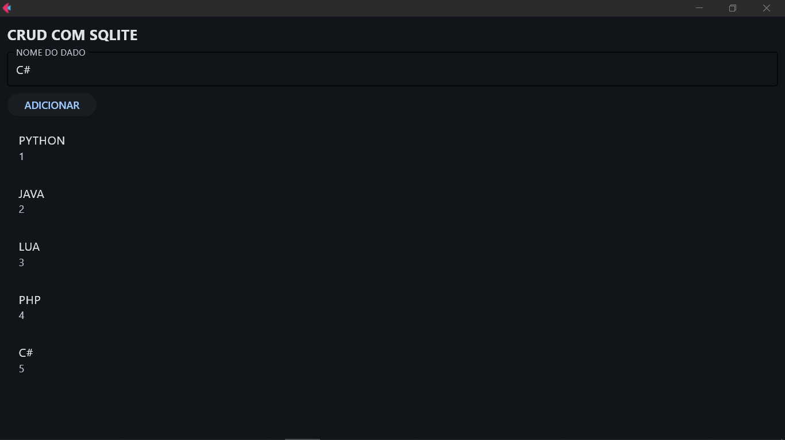
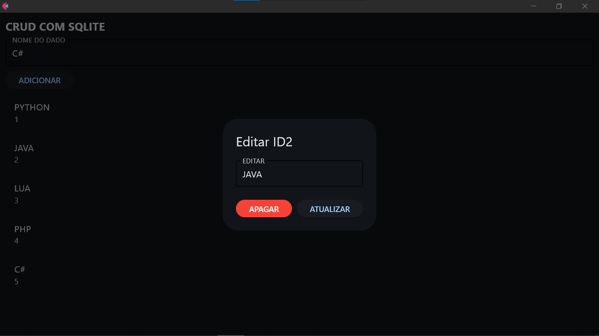
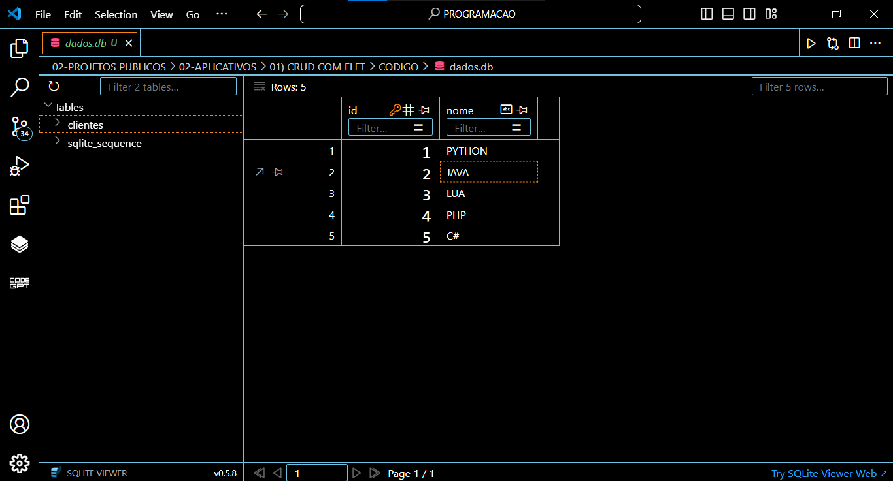

# CRUD COM FLET
👨‍🏫CRUD DE DADOS COM FLET E SQLITE.

 <br>
 <br>
 <br>

## DESCRIÇÃO:
Este aplicativo é uma interface gráfica desenvolvida em Python utilizando a biblioteca Flet. O aplicativo implementa um CRUD (Create, Read, Update, Delete) simples para gerenciar dados de clientes armazenados em um banco de dados SQLite. 

## FUNCIONALIDADES:
1. **Criação do Banco de Dados:**
   - O aplicativo cria automaticamente uma tabela chamada `clientes` em um banco de dados SQLite chamado `dados.db` se esta não existir. Esta tabela armazena o ID e o nome dos clientes.

2. **Adicionar Dados:**
   - Um campo de texto e um botão para adicionar novos registros (nomes) à tabela `clientes`.

3. **Listar Dados:**
   - Exibe todos os registros da tabela `clientes` em uma lista.

4. **Editar Dados:**
   - Permite editar o nome de um cliente existente. O usuário pode clicar em um item da lista para abrir um diálogo de edição.

5. **Deletar Dados:**
   - Permite deletar um cliente existente. O usuário pode clicar em um item da lista para abrir um diálogo onde a opção de deletar está disponível.

## COMO USAR?
1. **Instalação da Biblioteca Flet:**
   - Certifique-se de ter o Python instalado em seu sistema.
   - Instale a biblioteca Flet utilizando o seguinte comando no terminal:
     ```sh
     pip install flet
     ```

2. **Execução do Código:**
   - Execute o arquivo, no diretório `CODIGO`, usando o comando:
     ```sh
     python CODIGO.py
     ```

3. **Adicionar um Novo Cliente:**
   - Digite o nome do cliente no campo de texto abaixo de "NOME DO DADO".
   - Clique no botão "ADICIONAR".
   - O novo cliente será adicionado e aparecerá na lista.

4. **Editar um Cliente Existente:**
   - Clique em um item da lista para abrir o diálogo de edição.
   - No diálogo, edite o nome do cliente no campo "EDITAR".
   - Clique no botão "ATUALIZAR" para salvar as alterações.

5. **Deletar um Cliente:**
   - Clique em um item da lista para abrir o diálogo de edição.
   - No diálogo, clique no botão "APAGAR" para deletar o cliente.

## CREDITOS:
- [PROJETO CRIADO PELO VILHALVA](https://github.com/VILHALVA)


